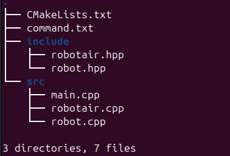

# SEKURO 25 Tugas 1 DIVISI PROGRAMMING

# Tenggat Waktu : Jumat, 21 Maret pukul 23.59 WIB

### *[PERINGATAN]*:  Silahkan klik "Use This Template" pada repo ini lalu kalian buat repo baru dengan format SEKURO_TUGAS_1_{Nama}_PROGRAMMING
### *[PERINGATAN]*: Untuk Mengerjakan soal soal berikut kalian bisa akses soal nya yang terdapat pada folder soal dan kalian wajib menaruh jawaban pada folder src
### berikut contoh format cara menyimpan jawaban:

## ROS 2
Tugas Sekuro kali ini akan mengesah semua pengetahuan kalian mengenai materi yang kalian pelajari pada Day 1 sekuro mengenai ROS 2. Penggunaan AI diperbolehkan, namun kami berharap kalian tidak menggunakan AI secara penuh dalam mengerjakan tugas ini dan menggunakan materi yang telah kami berikan agar materi yang disampaikan lebih masuk.
1) Buatlah sebuah workspace dengan sebuah package didalamnya (Penamaan dibebaskan). Package tersebut akan mengandung program ROS 2 kalian yang mengandung seminimal-minimalnya mengandung satu publisher node, satu subscriber node, dan satu topic. Program ROS 2 Anda boleh dibuat dengan sekreatif mungkin, namun minimal terdapat komunikasi antara publisher dan subscriber tersebut.

2) Anda perlu merekam dan menjelaskan cara kerja program dari proses run hingga menghasilkan output, serta struktur folder workspace Anda. Selain itu, Anda perlu juga merekam node dan topik yang berjalan, informasi node dan topic, dan isi pesan dari topic yang kalian buat. Video maksimal 5 menit, tidak diwajibkan untuk menampilkan muka Anda di dalam rekaman tersebut, dan perlu terdapat suara Anda yang jelas.

## Standard Template Library

### Gunakanlah <code>std::vector</code> dan <code> std::map</code> untuk mengerjakan soal soal berikut:

Soal: Robot Penjaga Gudang
Deskripsi
Sebuah robot penjaga gudang bergerak di sepanjang koridor lurus. Di koridor tersebut terdapat n buah paket yang diletakkan di berbagai titik koordinat x. Setiap paket memiliki sebuah ID Kategori (angka bulat).

Robot memulai perjalanannya dari koordinat terkecil yang memiliki paket dan bergerak hanya ke arah kanan (koordinat x yang semakin besar).

Robot memiliki misi untuk mengambil paket sebanyak mungkin. Namun, robot memiliki keterbatasan memori: Robot tidak boleh mengambil paket dengan kategori yang sudah pernah ia ambil sebelumnya.

### Tentukan berapa banyak paket maksimal yang bisa diambil oleh robot!

### Format Input

Baris pertama berisi satu integer n (1≤n≤10^5) — jumlah paket.

Baris kedua berisi n integer xi(−10^9≤xi≤10^9) — posisi koordinat tiap paket.

Baris ketiga berisi n integer ci(1≤ci≤10^9) — ID kategori tiap paket.

### Format Output
Cetak satu bilangan bulat yang menyatakan jumlah paket maksimal yang dapat diambil.

### contoh 1:

INPUT:

OUTPUT:

### contoh 2:

INPUT:

OUTPUT:

## OOP

1) Lengkapilah file [core_mcu.cpp](src/oop_soal_1/core_mcu.cpp) serta [core_mcu.hpp](src/oop_soal_1/core_mcu.hpp) yang terdapat pada folder [soal](src/oop_soal_1/core_mcu.hpp) berikut.implementasikan kelas Core_MCU yang terdapat pada file-file tersebut agar main.cpp dapat di jalankan dengan output yang tertera di bawah ini! *[TIPS]*: Pelajarilah Cara menggunakan Konstruktor dan destruktor. untuk soal ini kalian di perbolehkan dan bahkan di anjurkan untuk mengkompile menggunakan g++ untuk mendapatkan outputnya.

2) Lengkapi dan Implementasikanlah file-file berikut agar main.cpp dapat di run dan menghasilkan output yang ada pada gambar di bawah ini,Gunakanlah prinsip-prinsip inheritance,virtual,serta static [PERINGATAN] [main.cpp](src/oop_soal_2/main.cpp) dilarang untuk diubah dihapus ataupun diedit (gunakanlah g++ untuk mengcompile file-filenya):
- [mcu.cpp](src/oop_soal_2/mcu.cpp)
- [mcu.hpp](src/oop_soal_2/mcu.cpp)
- [mcu_walker.cpp](src/oop_soal_2/mcu_walker.cpp)
- [mcu_walker.hpp](src/oop_soal_2/mcu_walker.hpp)
- [mcu_cam_controller.cpp](src/oop_soal_2/mcu_walker.cpp)

Berikut Adalah Outputnya:

## CMAKE
- Ubahlah folder structure pada soal no 2 bagian OOP (kalian hanya perlu mengcopy/dupe file2 yang terdapat pada soal no2 OOP kedalam folder_cmake di folder src jawaban kalian lalu kalian atur struktur foldernya) lalu lengkapilah file [CMake](soal/soal_cmake/CMakeLists.txt) berikut pastikan ketika cmake di build akan ada .exe yang terbuild di dalam folder bin!

# GOOD LUCK !!!
